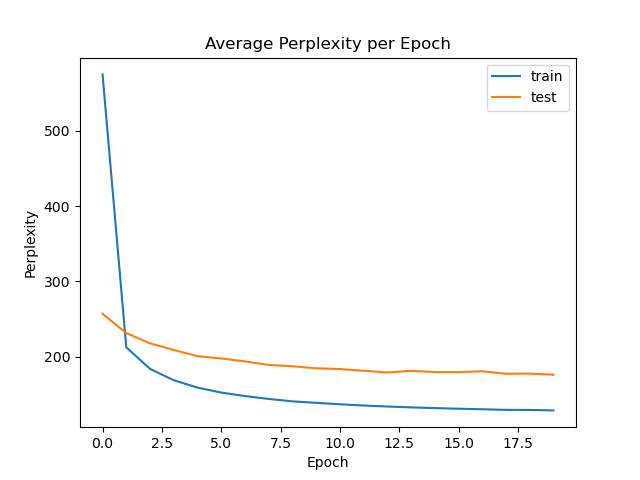
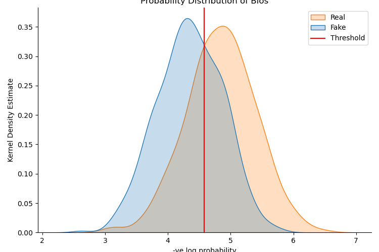
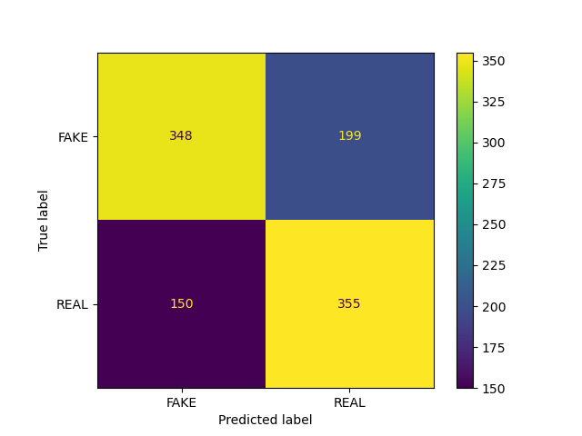
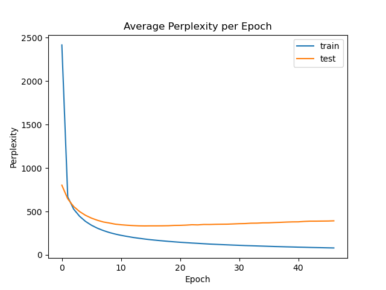
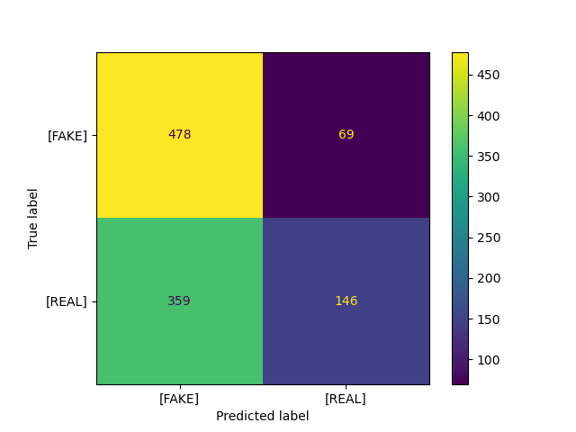
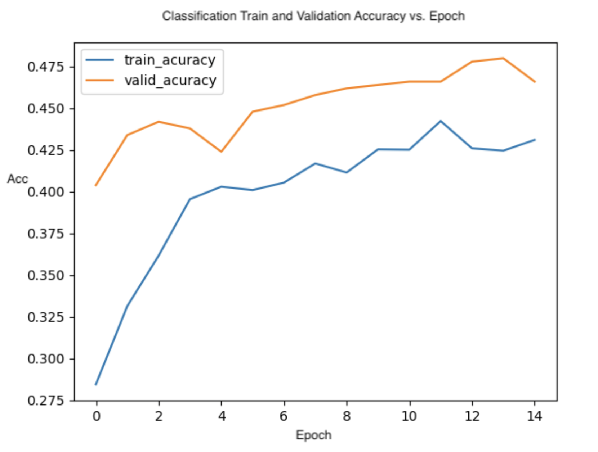
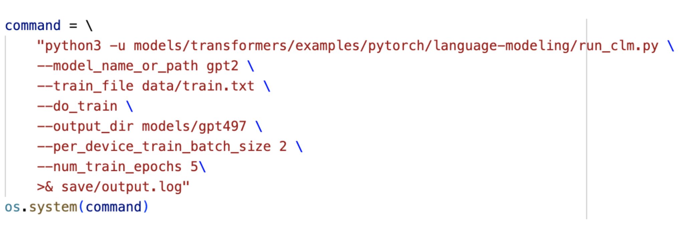

# Language Modeling NLP Experiments
The projects in this repository are created to experiment with different model architectures on different NLP tasks.  

 - The first project (Fakes Detection) uses the Feed Forward Neural Network (FFNN) and the Long Short Term Memory (LSTM) architectures in two different experimetns to classify different datasets of biographies into REAL or FAKE labels, where REAL indicates that the biography is a real one, and fake indicates that it was synthesized by another language model.

 - The second project (Question Answering) uses transformers imported from the [Hugging Face transformers library](https://huggingface.co/docs/transformers/index) to perform the NLP task of multiple choice question answering by fine tuning the bert-base-uncased  BERT pretrained model using a classification approach, and the gpt-2 pretrained model using a generative approach.

# Project 1: Feed Forward NN / LSTM Fakes Detection 

## Dataset
The dataset used to train two models (FFNN, LSTM) is a collection of small biographies marked at the end of each biography as [REAL] or [FAKE], where fake biographies are ones generated by computers. The datasets are available in the [`fakes-detection-ffnn-lstm/data`](fakes-detection-ffnn-lstm/data) directory. The dataset used to train is the mix.train.tok dataset provided of the tokenized and lowercase corpus of real and fake biographies. For validation purposes we used the mix.valid.tok dataset, and for testing the mix.test.tok dataset was used. Additionally, we performed Fakes Detection on the blind.test.tok dataset.

## Part 1: FFNN
We designed a Feed Forward Neural Network (FFNN) language model (LM) that predicts the next word in a sequence. The window size used in FFNN model is 3, therefore the model took a sequence of size 3 as input and output the next word, and so on. The following parameters were used during training and testing of the model, which took approximately 4 hours to train on the Moore Northwestern remote server. 
Namespace(d_model=100, batch_size=200, window=3, epochs=20, lr=0.0001, dropout=0.35, model='ffnn', trainname='./mix.train.tok', validname='./mix.valid.tok', testname='./mix.test.tok', vocab_size=35150, fnn_threshold=4.5806)

After training, the learning curve (Figure 1) was constructed to show the average training perplexity per epoch for the train set and the test set. After each epoch of training on the train set the model goes into test mode where it runs the same training function on the test set without updating weights to check the performance of the model. Figure 1 is shown below.

### Figure 1: FFNN - Learning Curve

We reasoned that the FFNN on its own is unreliable in performing Fakes Detection, as only the last 3 words leading up to the [REAL] or [FAKE] are unlikely to reliably predict the label. This is a limitation of FFNNs. To perform fakes classification, we performed the following steps. For each biography, we use the FFNN to generate probabilities for every 'next word'. We select the probability of the actual word in the biography from the FFNN's predictions. We then find the average negative log probability on the biography, and create a kernel density estimation plot for 'real' and 'fake'. We manually selected a threshold where the two KDEs intersect, as shown in Figure 2 below.

### Figure 2: FFNN - Probability Distribution of Bios

Because most of the real bios fall to the right of the threshold and most of the fake bios are on the left, we can use this threshold to classify biographies in the test set. Conceptually, this strategy works (the two distributions differ) because a neural net is more likely to predict words in a sequence that were machine generated. So, a fake biography tends towards having a higher probability (or lower negative log probability).

In addition to the limitations of the FFNN described above, which we devised a solution for, there are other limitations of our model. It is possible that the model is overfitting as we don't use many regularization techniques such as clipping though we use dropout regularization. In addition, the testing framework also has a limitation in that there is high overlap between the distributions as shown in Figure 2 above, resulting in worse performance.

Using a threshold generated from the mixed validation set, we classified all the bios in the mixed test set. We achieved 66.8% accuracy on the test set, and the confusion matrix in Figure 3 shows the number of real and fake classifications shown below.

### Figure 3: FFNN - Confusion Matrix

The precision, recall, accuracy, and f1-score of FFNN were summarized in the table shown below. The model was somewhat more likely to misclassify fake bios as real ones (199/547=36.4%), as opposed to misclassifying real bios as fake ones (150/505=20.7%).

### Table 1: FFNN - Performance Metrics

| Precision | Recall | Accuracy | F1-Score |
| --- | --- | --- | --- |
356/556 = 0.64 | 356/505 = 0.7 | 66.83% | 0.671 | 

## Part 2: LSTM
We also designed a Long Short-Term Memory (LSTM) language model (LM). It was used for fake detection by predicting the next word in a sequence. The window size used in the LSTM model is 30, therefore the model took a sequence of size 30 as input and output the next word, and so on. The following parameters were used during training, validating, and testing of the model, which took approximately 3 hours to train on the Moore Northwestern remote server.
Namespace(d_model=64, batch_size=20, seq_len=30, epochs=20, lr=0.0001, dropout=0.35, model=‘lstm', trainname='./mix.train.tok', validname='./mix.valid.tok', testname='./mix.test.tok', vocab_size=35150)

After training, the model generated the learning curve (Figure 4) to show the average training perplexity per epoch for the training dataset and the validation dataset. After each epoch of training on the dataset, the model went into test mode where it ran the same training function on the testing dataset without updating weights to evaluate the performance of the model. Figure 4 is shown below.

### Figure 4: LSTM - Learning Curve

Our LSTM model achieved 59.3% accuracy on the testing dataset and the confusion matrix in Figure 5 below shows the number of real and fake classifications.

### Figure 5: LSTM - Confusion Matrix

The model was much more likely to incorrectly predict a real bio as a fake one (359/505 = 71.1%), as opposed to predicting a fake bio as a real one (69/547 = 12.6%). The precision, recall, accuracy, and f1-score of the LSTM model were summarized in Table 2 below.  

### Table 2: LSTM - Performance Metrics

| Precision | Recall | Accuracy | F1-Score |
| --- | --- | --- | --- |
146/215 = 0.679 | 146/505 = 0.289 | 59.32% | 0.406

The performance of the LSTM model was worse than the one of the FFNN model. The dimensions of the trained model were only 64, which may have been too small to achieve the learning task. Increasing the dimensions to 512 would likely improve performance. In addition, another limitation that can be found is overfitting. LSTMs are easily susceptible to overfitting, this can be seen in Figure 4 above, where near the twentieth epoch, the testing perplexity begins to uptick. This is an indication of overfitting because the training dataset continues to improve but the validation dataset starts to degrade. We don't use any other regularization techniques except dropout regularization.

## Part 3: Performing Fakes Detection on the Blind Testing Dataset

Based on our evaluation of the FFNN and LSTM, the FFNN performed better on the labeled test set, achieving 66.8% accuracy, while the LSTM only achieved 59.3% accuracy. Using the FFNN model along with the threshold we determined from the labeled test set, we generated predictions for the 500 blind observations. This file is called “FFNN_blind_test_labels.csv” and contains [REAL] and [FAKE] predictions for each observation. One limitation of this technique is that the predictions rely on this single threshold that was produced from our limited held-out test data, and this distribution may vary from that of the blind test data, resulting in more misclassifications.

## Reproducing Results

In the main function found in [`fakes-detection-ffnn-lstm/fakes-detection.py`](fakes-detection-ffnn-lstm/fakes-detection.py), there are many arguments that can be specified to run different parts of the experiment with different hyper-parameters. We've simplified this such that the user needs to only specify 2 arguments: 
 1. model: can take 2 values, either 'ffnn' for the feed forward NN, or 'lstm' for the lstm.
 2. mode: the mode wanted to run on (train, eval, test) and is available for both models. The ffnn model also has a plot mode which plots the probability distribution plot shown in figure 2 above.

For example, the following is a sample script to run from the root directory to get testing results for ffnn on the blind dataset.

    python3 fakes-detection-ffnn-lstm/fakes-detection.py -model=ffnn -mode=test
    
# Project 2: BERT / GPT2 Question Answering

## Part 1: BERT Classification Approach

Our approach to performing classification on a dataset of multiple choice questions started with using the PyTorch and Hugging Face's transformers library and using BERT. We began by initializing and setting up the 768x2 linear layer. The output of the Bert model, or the 'last hidden state', is passed through the linear layer to produce the classification output. This output is structured as a 4x2 matrix: 4 letter choices, with 2 logits each representing the pseudo-probabilities for False and True. We apply softmax to each row of logits to get real probabilities for each class. To classify an output as a specific letter, we find the 'True' (or '1') logit with the greatest probability, and output the corresponding letter.

We preprocess our data from the JSON files of multiple choice questions from the OpenBook QA dataset in [`question-answering-bert-gpt/data`](question-answering-bert-gpt/data). Our code reads in each object and extracts the fact and question, and it concatenates them with a separator token. Then, each of the four answers are concatenated with another separator token and either a 1 or a 0 to indicate true or false. A sample observation is shown below:

    [
    ['nocturnal predators hunt during the night [SEP] Owls spend their nights tending to their homes [SEP]', 0], 
    ['nocturnal predators hunt during the night [SEP] Owls spend their nights sleeping in hollow logs [SEP]', 0],
    ['nocturnal predators hunt during the night [SEP] Owls spend their nights scanning their territory for field mice [SEP]', 1],
    ['nocturnal predators hunt during the night [SEP] Owls spend their nights hanging out with other owls [SEP]', 0]
    ]

 During training, each observation is fed into the model, and the weights in the linear layer are updated. We do not update the weights of the pretrained Bert model. We trained with a learning rate of 3e-05 for 15 epochs. See Figure 6 below for plots of training and validation accuracy vs. epoch.

### Figure 6: BERT - Learning Curve
 
 
 
  The validation accuracy was consistently higher than the training accuracy at each epoch. This may indicate that the validation set was slightly skewed which resulted in better performance, or there is some problem with our training process. This may be considered as a limitation that needs further investigation. The model is saved during training whenever the validation accuracy increases, regardless of training accuracy. This ensures the model does not overfit, as validation accuracy is an indicator of generalization, while high training accuracy could be a sign of overfitting. We evaluated the model in 2 methods, one using an untrained linear layer to perform zero-shot evaluation, and the other was fine-tuned evaluation after training the linear layer. The results are shown below:

    Zero-shot validation accuracy: 0.282 | Test accuracy: 0.272 
    Fine-tuned validation accuracy: 0.480 | Test accuracy: 0.458

The fine-tuned accuracies are much higher than the zero-shot accuracies, which is almost randomly guessed (uniform prob of 25%), meaning our fine-tuning had some success. One limitation is that we aren't using regularization when training the linear layer. Additionally, in our initialization of the Classify class, we disabled gradient updates for the pre-trained BERT model used as it was taking a long time to get through one iteration. You'll notice the optimizer takes in the linear layer as the model instead of BERT because it's the thing we want to update the weights of and train, to fine-tune the model. This method may have decreased our accuracy, but it sped up training considerably. Finally, validation accuracy gradually increased from epoch to epoch, so performance may have increased with even more epochs. Experimenting with different learning rates and tweaking other hyperparameters may have also improved performance.

## Part 2: GPT-2 Generative Approach
Our generative approach begins by initializing and loading the pretrained GPT-2 model. We use cross entropy loss as our loss function. We preprocess our data by concatenating the fact, the question, the answers, and the correct answer, all separated by [SEP] tokens and an [ANSWER] token, as observations.

    Input Prompt: deep sea animals live deep in the ocean [SEP] Frilled sharks and angler fish live far beneath the surface of the ocean, which is why they are known as [SEP] A Deep sea animals B fish C Long Sea Fish D Far Sea Animals [ANSWER]
    Label: A
    Predicted Label: tensor(35)
    tokenizer.decode(pred_label) = D
    A != D, so Incorrect prediction

We concatenate all of these observations into a single text file to use for training. We then fine-tune the GPT2 model using the run_clm.py script from the Hugging Face [transformers/examples](https://github.com/huggingface/transformers) library. The script and parameters we use are shown below in Figure 7.

### Figure 7: Fine-tuning GPT-2 model in generative approach

 This generates the model 'gpt497' as the fine-tuned model. Our model evaluation works as follows. We pass in the input prompt, and then take the last output logit and apply softmax to obtain probabilities for words in the vocabulary. Then, we select 1 of the 4 goal labels with the highest probability, and compare this label to the true label. We evaluated using 2 different models, the first being the pre-trained gpt2 model from the Huggingface transformers library to perform zero-shot accuracy, and a gpt497 which is the fine-tuned version of the gpt2 model we trained using the method described earlier. Our results are as shown:

    Zero-shot validation accuracy: 0.244 | Test accuracy: 0.256 
    Fine-tuned validation accuracy: 0.282 | Test accuracy: 0.272

The main limitation of this approach is our training. We provide the data as a single text file, and the GPT2 weights are fine-tuned to minimize loss over the entire corpus, instead doing a single update for each input prompt. This allows the model to better-understand the overall structure of the data, but didn't result in significant improvements to accuracy (4% and 2% improvements in our validation and test accuracy). We could likely improve the effectiveness of our fine-tuning by writing a custom training loop that performs more targeted weight updates for our specific problem. We could also experiment with different hyperparameters. We attempted to train with more epochs, as we used 10 instead of 5 and it actually scored a worse validation and training accuracy, which could mean the model overfit. An improvement we could have explored is different prompting methods which could have yielded better results.
Overall, our classification approach yielded better results, with 48% validation and 45.8% test accuracy. This approach is more tailored to the prompted question answering problem, as we were able to design a specific structure to support our question and answer format. The loss calculations and updates directly worked to improve the model's ability to accurately label each potential answer as True or False, resulting in decent performance on the test sets. For classification, the outputs are constrained to 2 probabilities for our 4 options. On the other hand, for generations, we are losing information by trying to predict probabilities for a whole vocabulary of 50,000+ words, as the probabilities for the 4 labels we care about may be extremely small in magnitude (and very close to each other). Overall, classification seems to lend itself more towards this specific task, as we were able to achieve nearly 50% accuracy after only a couple hours of training for the linear layer.    

## Reproducing Results

In the main function found in [`question-answering-bert-gpt/question-answering.py`](question-answering-bert-gpt/question-answering.py), there are 2 arguments that can be specified to run different parts of the experiment:
 1. model: can take 2 values, either 'classifier' or 'generator'. The classifier model is the classification approach, and the generator model is the generative approach. The default model is 'classifier'.
 2. mode: the mode wanted to run on ('train' or 'test') and is available for both models. The default mode is 'test'.

For example, the following is a sample script to run from the root directory to get fine-tuned classifier Validation  and test accuracy

    python3 question-answering-bert-gpt/question-answering.py -model=classifier -mode=test

# Authors
 - Omar Khatib:
        - [LinkedIn](https://www.linkedin.com/in/omar-khatib-01/)
        - [GitHub](https://github.com/OmarKhatib01)
        - [Portfolio](https://omarkhatib01.github.io/)

 - Will Smart:
        - [LinkedIn](https://www.linkedin.com/in/will-smart/)
        - [GitHub](https://github.com/wsmartf)
